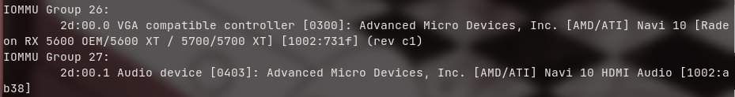
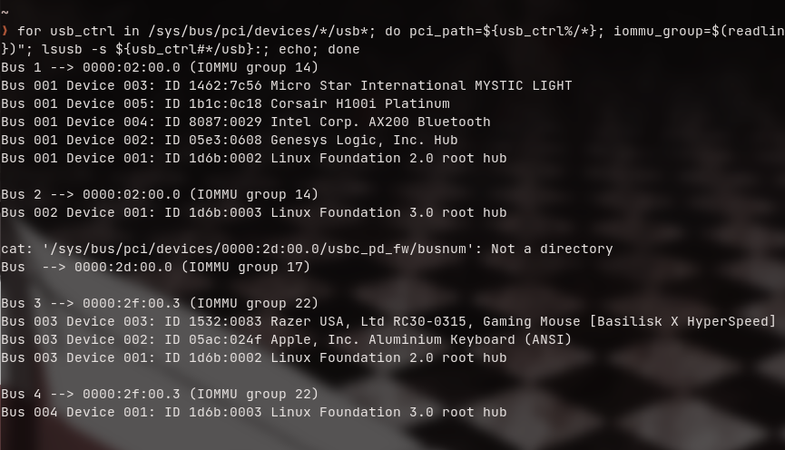
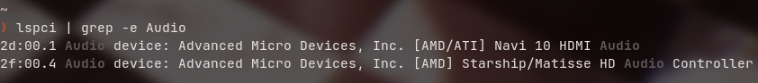
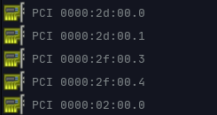
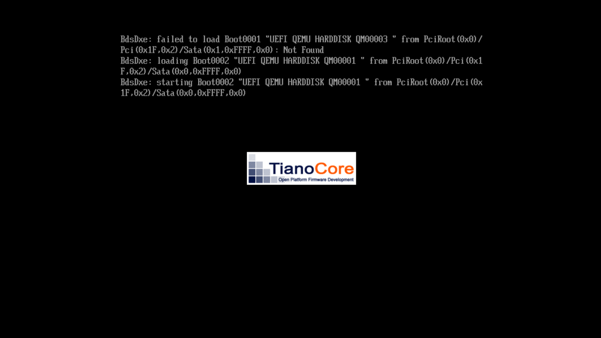

# SingleGPU-Passthrough-AMD

Tutorial on how to passthrough your AMD GPU into a KVM

# ATTENTION:

Hot-plugging for AMD GPUs is now here with the [5.14 Kernel](https://www.omgubuntu.co.uk/2021/08/linux-kernel-5-14-new-features). However, my experiences with it have not been great with it. You can skip to [QEMU Hooks](#QEMU-Hooks) if you do not need `vendor-reset`. If you plan on using vendor-reset with a 5.14+ kernel, you should most likely switch to an LTS kernel. I use Linux-vfio-lts which has worked very well for me as I have all the features I need (ACS Patching).

# Kernel parameters

To begin, you must enable either **Intel VT-d** for **Intel CPUs** or **AMD-Vi** for **AMD CPUs** in your BIOS. If you can’t find one of those options in your BIOS, you most likely have hardware that doesn’t support it.

After that, boot into Linux and add these to your [Kernel Parameters](https://wiki.archlinux.org/title/Kernel_parameters):

For Intel: `intel_iommu=on iommu=pt video=efifb:off`

For AMD: `amd_iommu=on iommu=pt video=efifb:off`

We need `video=efifb:off` as the EFI Framebuffer on the GPU will latch onto the GPU BARs. In simpler terms, it will allow you to shut down your Virtual Machine.


You also need to edit `/etc/mkinitcpio.conf` and add `amdgpu` inside of `MODULES=()` just in case your keyboard doesn’t work on your PC when booting in. It should look like `MODULES=(amdgpu)` and then finally, run `sudo mkinitpcio`. This is usually only needed if you encrypt your Linux drive

The link [Here](https://wiki.archlinux.org/title/Kernel_parameters) should tell you where to put it depending on your bootloader

---

## Notes Before you continue

You cannot get access to your host machine if you do this until you shut down the VM. You can SSH into your machine, but having full access to it is not possible as the GPU has been passed through to the virtual machine.

You also need libvirt and virt-manager for this.

---
| Vendor | Family | Common Name(s)
|---|---|---|
|AMD|Polaris 10| RX 470, 480, 570, 580, 590
|AMD|Polaris 11| RX 460, 560
|AMD|Polaris 12| RX 540, 550
|AMD|Vega 10| Vega 56/64/FE |
|AMD|Vega 20| Radeon VII |
|AMD|Navi 10| 5600XT, 5700, 5700XT
|AMD|Navi 12| Pro 5600M |
|AMD|Navi 14| Pro 5300, RX 5300, 5500XT
|AMD|Navi 21| RX 6900XT (Community Tested)

- Community Tested is essentially community reports from what I have heard of what works. If you have found an AMD card that works outside that list with `vendor-reset`, please let me know.

- According to some users, Navi 21 cards do not need vendor-reset

Another problem is that not all kernels work with vendor-reset. Vendor-reset doesn’t rely on kernel patching, as it uses `ftrace` to hook the `pci_dev_specific_reset` identifier. 

---
## To confirm if your kernel is compatible:

```bash
./kernel-ftrace-check.sh
```

If the output states `Ftrace is not available in your kernel.` It is because your kernel does not have support for `ftrace` or just my code stopped working.

## What do I do if ftrace doesn’t work for my kernel?

There is not much, to be honest. You could either try to apply the ACS patch to your kernel but that would require compiling it which may take a while. Or you can switch to another a kernel which does support ftrace. However, most kernels should already have this.

# Installing Vendor-Reset:

Now you get to the big boy stuff. You will need to start off compiling `vendor-reset` using these steps:

```bash
git clone https://github.com/gnif/vendor-reset.git
cd vendor-reset
sudo dkms install .
```

# QEMU Hooks

QEMU Hooks are essentially just a way to trigger custom scripts. They can execute custom scripts when a Virtual Machine instance has started.

We need these scripts to shut down our KVM and be able to go back into our host machine. To set up the first half of QEMU Hooks, we need to download the script for it like so:

```bash
sudo mkdir -p /etc/libvirt/hooks/
sudo wget https://raw.githubusercontent.com/PassthroughPOST/VFIO-Tools/master/libvirt_hooks/qemu \
     -O /etc/libvirt/hooks/qemu
sudo chmod +x /etc/libvirt/hooks/qemu
```

We will do the second half when you get to set up the Virtual machine itself.

# Passing through everything needed

## What we need to passthrough:

- The GPU itself
- USB Controller(s)
- Your headphones (Depending on whether they have their own PCIe device or not)
- Graphics card audio

---
## Graphics card: 

To pass this through, we first have to find the device by entering this command:

```bash
#!/bin/bash
shopt -s nullglob
for g in `find /sys/kernel/iommu_groups/* -maxdepth 0 -type d | sort -V`; do
    echo "IOMMU Group ${g##*/}:"
    for d in $g/devices/*; do
        echo -e "\t$(lspci -nns ${d##*/})"
    done;
done;
```

You should get an output with a lot of your PCIe devices. You need to locate your GPU 



We have now both our GPU and GPU Audio.

---
## ACS Patching (OPTIONAL):

If you find your PCI devices grouped among other devices that you do not wish to pass through, you can separate them with ACS Patching. Please read about [The risks](https://vfio.blogspot.com/2014/08/iommu-groups-inside-and-out.html) before continuing on with this.

To do an ACS patch, you must have a kernel with the patch applied. The easiest way to do this is by simply just installing the `Linux Zen Kernel` or the `Linux VFIO Kernel` or else you would have to manually patch your kernel.

To enable the patch, you must add this to your [bootloader kernel parameters](https://wiki.archlinux.org/title/Kernel_parameters):

```bash
pcie_acs_override=downstream,multifunction
```

Every bootloader is different with adding bootloader kernel parameters. [Click Here](https://wiki.archlinux.org/title/Kernel_parameters) if you do not know how to add things to your bootloader kernel parameters.

Once you’ve done that, you must reboot and then check your IOMMU groups again. It should work!

---
## USB Controllers:

To get full USB functionality on our guest machine, I recommend passing through a USB controller to avoid the quirks of USB emulation. Let’s start by running this command:

```bash
for usb_ctrl in /sys/bus/pci/devices/*/usb*; do pci_path=${usb_ctrl%/*}; iommu_group=$(readlink $pci_path/iommu_group); echo "Bus $(cat $usb_ctrl/busnum) --> ${pci_path##*/} (IOMMU group ${iommu_group##*/})"; lsusb -s ${usb_ctrl#*/usb}:; echo; done
```

Your output should show all of your USB devices connected. Here’s my output:



We see some devices in my config called `Linux Foundation .. root hub` (This may be different for you). This is the USB controller. As we can see, Bus 1 and Bus 3 have all of our USB devices attached to them. We see these names:

`Bus 1 --> 0000:02:00.0 (IOMMU group 14)` & `Bus 3 --> 0000:2f:00.3 (IOMMU group 31)`

We only need `0000:02:00.0` & `0000:2f:00.3` from here as it’s the PCI devices that have all our USB devices. We will need to pass these through 

##### **NOTE: THIS WILL BE DIFFERENT FOR ALL MACHINES. PLEASE CHECK WHAT USB DEVICES ARE IN THAT GROUP**

## Audio:

##### **NOTE: IF YOU ARE USING A USB SOUND CARD/AUDIO INTERFACE YOU CAN SKIP THIS SECTION**

Now we want to passthrough our audio devices. To find what PCI device your sound card is on, check the output of this command:

```bash
lspci | grep -e Audio
```

This should show all of your audio devices:



As we can see, we have our Graphics Card audio and our headphones audio. 

We only need these parts from the output: `2d:00.1` & `2f:00.4` which we will need to passthrough. Again, these will be different for your machine.

# Attaching the PCIe devices to the VM

We can easily do this in virt-manager. We first actually need a machine to attach the PCIe devices to. I have a macOS KVM which I can do this on. 

Double click the Virtual Machine > Press the info button > Add Hardware > PCI Host Device and all the PCI devices you got from the outputs we did. This includes your GPU, GPU Audio, USB controllers, etc.

You may also see spice display stuff. Delete those as you don’t need them.

Your PCIe devices should now be on your host machine like so:



##### **NOTE: THE PCI DEVICE NUMBERS WILL BE DIFFERENT FOR YOU**

# Starting the VM

To start the VM, you must go into a TTY (CTRL + Alt + F2), log in with your credentials, and do the following:

```bash
sudo virsh start VM-NAME
```

If you don’t feel like starting it through a TTY all the time, follow the following down below:

# Scripts

For this bit, it will require a bit of manual work and will be a bit complicated to understand.

What these scripts do is take you into a TTY which is done by killing your login manager (lightdm, gdm, or whatever you use). This will need to be done in a script.

You must change the `VM-NAME` with your actual VM name that you have it set in libvirt. For e.g: my Virtual Machine is called `macOS` so:

```bash
mkdir -p /etc/libvirt/hooks/qemu.d/VM-NAME/prepare/begin
```

Will become:

```bash
mkdir -p /etc/libvirt/hooks/qemu.d/macOS/prepare/begin
```

(Do that command above btw)

After you’ve done that command, you must make a start.sh file inside the folder and put this inside:

<table>
<tr>
<th>
/etc/libvirt/hooks/qemu.d/VM-NAME/prepare/begin/start.sh
</th>
</tr>
<tr>
<td>

```bash
#!/bin/bash
set -x

killall lightdm # CHANGE TO YOUR DISPLAY MANAGER

sleep 3
```
</td>
</tr>
</table>

Now we have to do the same for the stop script, so:

```bash
mkdir -p /etc/libvirt/hooks/qemu.d/VM-NAME/release/end
```

Will become:

```bash
mkdir -p /etc/libvirt/hooks/qemu.d/macOS/release/end
```

Then, you must make a `revert.sh` file in the folder above with:

<table>
<tr>
<th>
/etc/libvirt/hooks/qemu.d/VM-NAME/release/end/revert.sh
</th>
</tr>
<tr>
<td>

```bash
#!/bin/bash
set -x

sleep 3
```
</td>

</tr>

</table>

Make them executable by doing:

```bash
chmod +x /etc/libvirt/hooks/qemu.d/VM-NAME/prepare/begin/start.sh
chmod +x /etc/libvirt/hooks/qemu.d/VM-NAME/release/end/revert.sh
```

Replace VM-Name with the name of your actual Virtual machine and if you’re lucky, you should get a boot screen in the VM!



---

# Any issues?:

contact my Discord: Itori#4589
